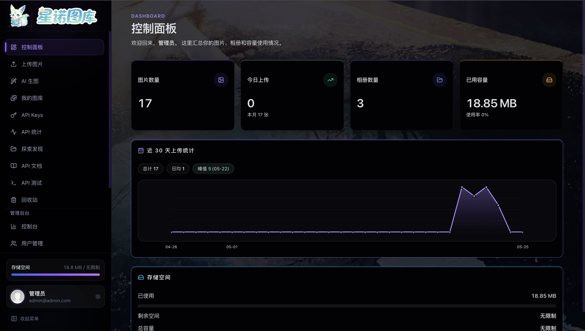
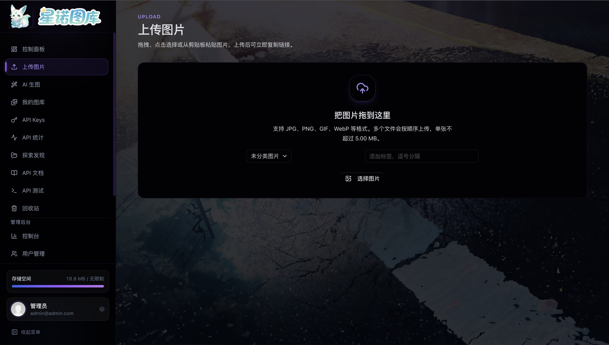
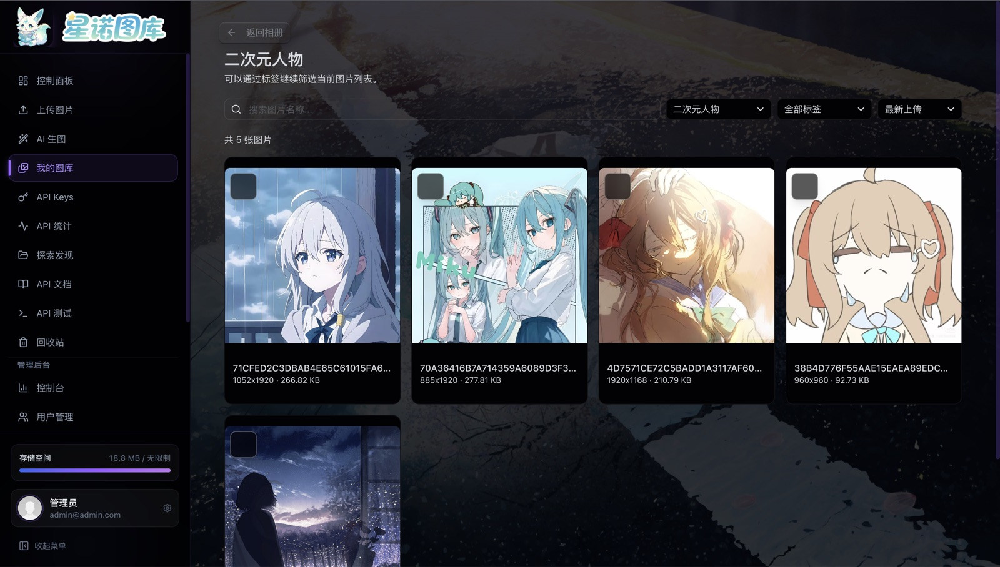
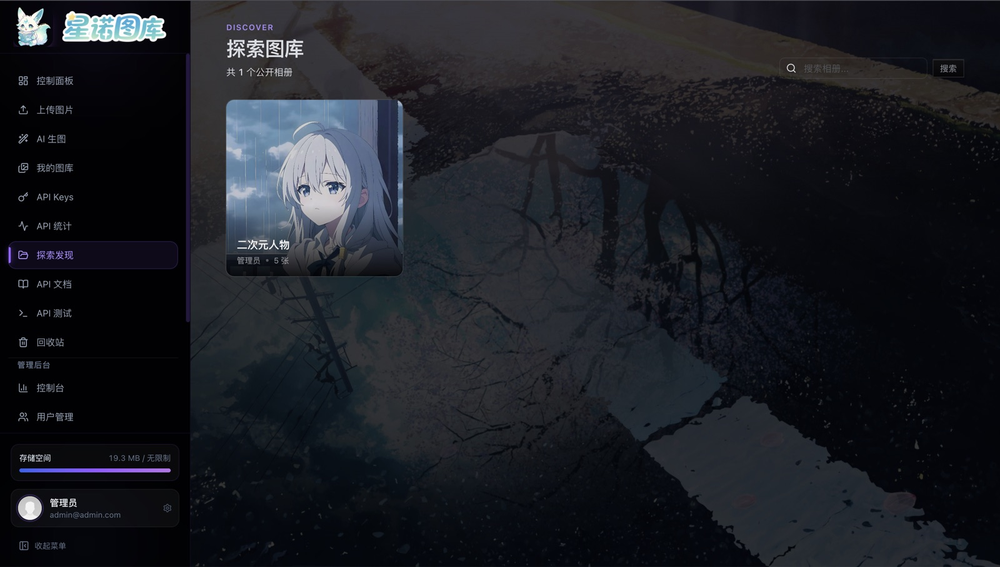
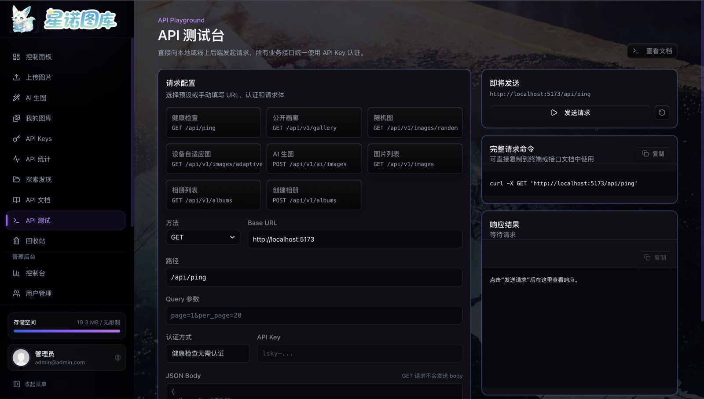

<p align="center">
  <a href="#" target="_blank">
    
  </a>
</p>

<p align="center">
  
</p>

<p align="center">
  <strong>新一代开源图床系统</strong> — 不只是存图片，更是你的图片资产管理中枢
</p>

<p align="center">
  <a href="https://github.com/swrited/Sino-Imgbed/stargazers"></a>
  <a href="https://github.com/swrited/Sino-Imgbed/issues"></a>
  <a href="https://github.com/swrited/Sino-Imgbed/blob/main/LICENSE"></a>
  
  
  
</p>

<p align="center">
  <a href="https://github.com/swrited/Sino-Imgbed"><strong>项目主页</strong></a> &nbsp;&bull;&nbsp;
  <a href="#快速开始"><strong>快速开始</strong></a> &nbsp;&bull;&nbsp;
  <a href="#功能特性"><strong>功能特性</strong></a> &nbsp;&bull;&nbsp;
  <a href="#技术架构"><strong>技术架构</strong></a> &nbsp;&bull;&nbsp;
  <a href="#部署"><strong>部署</strong></a> &nbsp;&bull;&nbsp;
  <a href="./CHANGELOG.md"><strong>更新日志</strong></a>
</p>

---

## 为什么选择星诺图库

市面上图床方案众多，但我们认为一个好的图库系统应该具备三个特质：**优雅易用**、**存储自由**、**可扩展**。星诺图库从设计之初就围绕这三点构建 —— 无论是个人开发者托管博客图片，还是团队共享设计素材，它都能提供流畅的体验。

- **零配置起步**：内置 SQLite，一条命令即可运行
- **存储策略自由**：本地磁盘、阿里云 OSS、腾讯云 COS、AWS S3、MinIO、WebDAV 一键切换
- **API 优先**：完整的 REST API + API Key 体系，轻松接入脚本、自动化工具或第三方应用
- **AI 增强**：支持 MiniMax、OpenAI、SiliconFlow 与兼容图片接口，将 AI 创作直接存入图库

## 功能特性

<table>
  <tr>
    <td width="50%">
      <h4>📤 多方式上传</h4>
      <p>拖拽、粘贴、批量上传，支持剪切板直接读图，上传完成后一键复制 URL / Markdown / HTML。</p>
    </td>
    <td width="50%">
      <h4>🗂️ 相册与标签</h4>
      <p>按项目、场景组织图片，支持标签检索和回收站恢复，图片管理不再混乱。</p>
    </td>
  </tr>
  <tr>
    <td>
      <h4>🔑 API 与 Token 双认证</h4>
      <p>支持 Bearer Token 登录态和 API Key 独立鉴权，提供细粒度的频次限制与用量统计。</p>
    </td>
    <td>
      <h4>🎨 AI 图片生成</h4>
      <p>接入 MiniMax、OpenAI、SiliconFlow 或兼容接口，在控制台内直接生成图片并自动归档。</p>
    </td>
  </tr>
  <tr>
    <td>
      <h4>⚙️ 多存储策略</h4>
      <p>本地、S3、OSS、COS、Kodo、USS、MinIO、WebDAV、SFTP、FTP，按需配置，迁移无缝。</p>
    </td>
    <td>
      <h4>👤 用户组权限控制</h4>
      <p>管理员可创建用户组，分配存储策略、容量配额与功能权限，适合团队与多租户场景。</p>
    </td>
  </tr>
</table>

## 技术架构

```
┌─────────────────────────────────────────┐
│           Nginx (反向代理 / 静态文件)         │
└──────────────┬──────────────────────────┘
               │
    ┌──────────┴──────────┐
    ▼                     ▼
┌─────────────┐   ┌───────────────┐
│  Vue 3 SPA   │   │  Go + Gin API  │
│  Vite Build  │   │  GORM / SQLite │
└─────────────┘   └───────┬───────┘
                          │
              ┌───────────┴───────────┐
              ▼                       ▼
        ┌──────────┐         ┌──────────────┐
        │  SQLite  │         │ MySQL (可选)  │
        │  内置    │         │ 生产推荐     │
        └──────────┘         └──────────────┘
```

| 层级 | 选型 | 说明 |
|------|------|------|
| 前端 | Vue 3 + TypeScript + Tailwind CSS + shadcn-vue | 现代化组件库，暗色主题，响应式布局 |
| 后端 | Go 1.21 + Gin + GORM | 高性能，低内存占用，编译为单二进制文件 |
| 数据库 | SQLite / MySQL | SQLite 开箱即用；MySQL 适合高并发场景 |
| 部署 | Docker / Docker Compose / 二进制 | 灵活适配各种环境 |

## 快速开始

### 方式一：Docker Compose（推荐）

```bash
git clone https://github.com/swrited/Sino-Imgbed.git
cd Sino-Imgbed

# 构建前端
cd frontend && npm install && npm run build && cd ..

# 启动服务
docker compose up -d
```

访问 [http://localhost:3000](http://localhost:3000)

默认管理员：`admin@admin.com` / `123456`

### 方式二：二进制部署

```bash
# 后端
cd backend-go
go build -o server cmd/server/main.go
./server

# 前端（另开终端）
cd frontend
npm install
npm run build
# 将 dist 目录通过 Nginx 或静态服务器托管
```

### 方式三：开发模式

```bash
# 后端（监听 :8000）
cd backend-go
go run cmd/server/main.go

# 前端（监听 :5173，热更新）
cd frontend
npm install
npm run dev
```

## 部署

### 生产环境 Docker Compose

使用 `docker-compose.prod.yml`，数据持久化到 Docker Volume：

```bash
docker compose -f docker-compose.prod.yml up -d
```

### Nginx 配置示例

```nginx
server {
    listen 80;
    server_name img.yourdomain.com;
    client_max_body_size 20M;

    root /var/www/sino-imgbed/frontend/dist;
    index index.html;

    location / {
        try_files $uri $uri/ /index.html;
    }

    location /api/ {
        proxy_pass http://127.0.0.1:8000;
        proxy_set_header Host $host;
        proxy_set_header X-Real-IP $remote_addr;
    }

    location /i/ {
        alias /var/www/sino-imgbed/backend-go/uploads/;
        expires 30d;
    }
}
```

### 环境变量

| 变量 | 默认值 | 说明 |
|------|--------|------|
| `DB_CONNECTION` | `sqlite` | `sqlite` 或 `mysql` |
| `DB_HOST` | `127.0.0.1` | MySQL 主机 |
| `DB_PORT` | `3306` | MySQL 端口 |
| `DB_USERNAME` | `root` | MySQL 用户名 |
| `DB_PASSWORD` | - | MySQL 密码 |
| `DB_DATABASE` | `lskypro` | 数据库名 |
| `APP_PORT` | `8000` | 服务端口 |
| `APP_URL` | `http://localhost:8000` | 公网访问地址 |
| `JWT_SECRET` | `lskypro-secret-change-me` | **生产环境必须修改** |

参考 `backend-go/.env.example` 创建实际配置文件。

## 项目结构

```
sino-imgbed/
├── backend-go/
│   ├── cmd/server/          # 服务入口
│   ├── internal/
│   │   ├── config/          # 配置 & 数据库初始化
│   │   ├── handler/         # HTTP 处理器
│   │   ├── middleware/      # 认证 / 日志 / CORS
│   │   ├── model/           # GORM 数据模型
│   │   ├── router/          # 路由定义
│   │   └── service/         # 业务逻辑（存储策略等）
│   ├── Dockerfile
│   └── go.mod
├── frontend/
│   ├── src/
│   │   ├── api/             # API 接口封装
│   │   ├── views/           # 页面视图
│   │   ├── stores/          # Pinia 状态管理
│   │   └── components/      # 组件库（shadcn-vue）
│   ├── Dockerfile
│   └── package.json
├── docker-compose.yml
├── docker-compose.prod.yml
└── nginx.conf
```

## 截图

### 控制面板

查看图片数量、相册数量、已用容量与近期上传趋势，快速掌握图库状态。



<table>
  <tr>
    <td width="50%">
      <strong>上传与归档</strong><br>
      <sub>拖拽上传、选择相册并设置标签。</sub><br><br>
      
    </td>
    <td width="50%">
      <strong>相册图片管理</strong><br>
      <sub>按相册与标签浏览、筛选图片。</sub><br><br>
      
    </td>
  </tr>
  <tr>
    <td width="50%">
      <strong>探索公开图库</strong><br>
      <sub>浏览公开相册并搜索公开内容。</sub><br><br>
      
    </td>
    <td width="50%">
      <strong>API 测试台</strong><br>
      <sub>测试随机图、设备自适应图、AI 生图等接口，并复制请求命令。</sub><br><br>
      
    </td>
  </tr>
</table>

## 交流与内测

欢迎加入微信内测群，反馈部署、使用和功能体验问题，也可以交流自建图库方案。

<p align="center">
  
</p>

## 路线图

- [ ] WebDAV 双向同步
- [ ] 图片压缩与水印
- [ ] 多语言支持（i18n）
- [ ] 插件系统
- [ ] S3 兼容预签名 URL

## 参与贡献

欢迎 Issue、PR 和 Star。请参阅 [CONTRIBUTING.md](./CONTRIBUTING.md) 了解开发规范。

<a href="https://github.com/swrited/Sino-Imgbed/graphs/contributors">
  
</a>

## 开源协议

[MIT License](./LICENSE) © Sino-ImgBed Contributors
